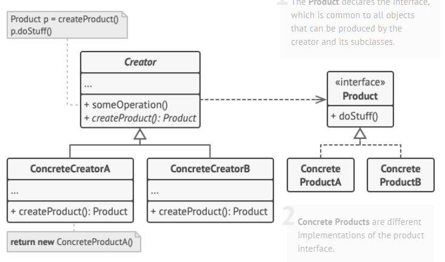
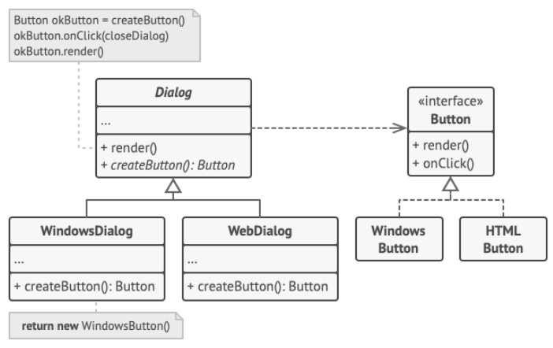

- Q: What is different between Factory Method and Abstract Factory?
- A: Factory Method is a method that creates objects, while Abstract Factory is an object that creates objects.
- Q: When to use Factory Method?
- A: When you want to create an object of a class that has subclasses and let subclasses decide which class to instantiate.
- What are the pros and cons of Factory Method?
- Pros:
    - It provides a way to delegate the instantiation logic to child classes.
    - It provides a way to create an object without exposing the creation logic to the client.
    - It provides a way to create an object without knowing the class of the object.
    - It provides a way to create an object without knowing the exact type of object.
- Cons:
    - The client needs to know the subclass of the object it wants to create.
    - It requires the creation of subclasses to implement the factory method.
    - It requires the client to create a subclass to implement the factory method.