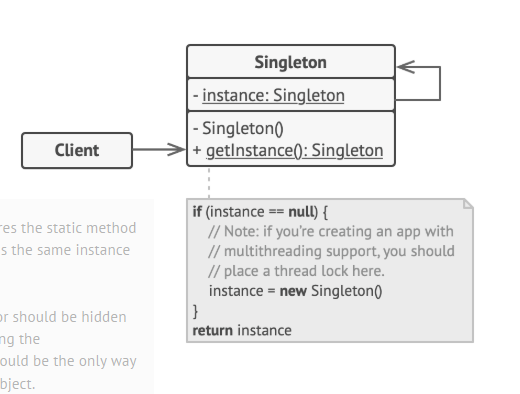

- Q: When do we use a singleton?
- A: We use a singleton when we need to control the number of instances that can be created, and to provide a global point of access to the object.
- Q: Why use synchronized block in getInstance() method?
- A: The synchronized block is used to make the getInstance() method thread-safe. If multiple threads access the method at the same time, then multiple instances of the singleton class may be created. The synchronized block ensures that only one thread can access the method at a time, preventing this issue.